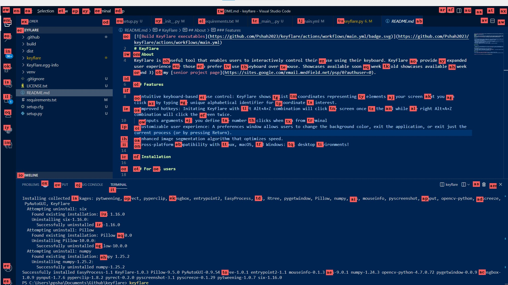

[](https://github.com/Pshah2023/keyflare/actions/workflows/main.yml)
# KeyFlare 
## About
Some users prefer using a keyboard over a mouse because of accessibility needs or personal reasons. KeyFlare enables users to interactively control their mouse using their keyboard.  Showcases available on my [website](https://www.pranitshah.cyou/keyflare). KeyFlare is open source, free, and both easy to understand and install.



## Installation

Suggested:
```sh
pip install keyflare
keyflare
```

Alternatively:
- Use `git clone https://github.com/Pshah2023/keyflare.git` to install the source code
- Optional: create a virtual environment with `python -m venv env` and activate it as per your system
- Install dependencies: `pip install -r requirements.txt`
- Go to the KeyFlare root directory and run `python keyflare`, which will run the code in `__main__.py` automatically.

### Inspiration

Vimium C, a common tool for users with accessibility needs for navigating web browsers, does not work on web browsers. Apple Voice Control's smart grid, a tool for navigating on Apple displays, does not work outside of an iPhone and would not be effective on large displays. There was no tool available for this, so I decided to make it.

### Features

- Intuitive Hotkey: (Left Alt) + (Lowercase A)
- Intuitive Process: KeyFlare simply opens up a fullscreen image to show you the options on the screen.
- Enhanced image segmentation algorithm that optimizes speed.
- Cross-platform compatibility with Linux, macOS, and Windows. (Untested on macOS since I do not have access to that environment at the moment.)

#### In the works

- Specifying the number of clicks desired through preferences.
- Making it easier to use KeyFlare through imports by improving the documentation.

**[Please fill out the survey](https://forms.gle/AVNGoHaFzGwHcsMz8)**